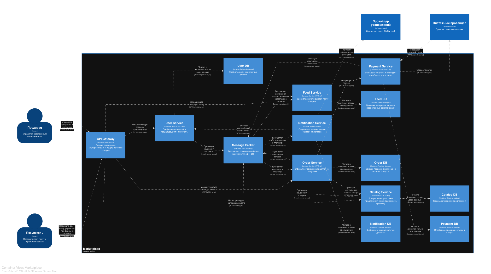

# Архитектура маркетплейса

В репозитории реализован только технический каркас **Catalog Service**: он запускается локально и в Docker и отвечает `200 OK` на `GET /health`. 

## C4 Container

Диаграмма показывает целевую архитектуру маркетплейса, а не состав запускаемого `docker-compose.yml`. Исходник: [`docs/c4-container.mmd`](docs/c4-container.mmd).



## Домены, ответственность и владение данными

| Домен / контейнер | Зона ответственности | Данные в единоличном владении |
|---|---|---|
| API Gateway | Единая внешняя точка входа, маршрутизация, общие политики аутентификации | Доменных данных нет |
| User Service | Покупатели, продавцы, роли, профили и контакты | Учётные идентификаторы, роли, профиль, разрешённые каналы связи |
| Catalog Service | Управление ассортиментом продавца и публикация изменений каталога | Товары, категории, описания, цены предложения, связь товара с продавцом |
| Feed Service | Построение и выдача персонализированной ленты | Признаки интересов, индекс выдачи, рассчитанные рекомендации |
| Order Service | Оформление заказа и управление его жизненным циклом | Заказы, позиции, снимки названий и цен, история статусов |
| Payment Service | Расчёт и учёт платежных операций, интеграция с провайдером | Суммы, статусы платежей, идентификаторы внешнего провайдера |
| Notification Service | Формирование и доставка уведомлений о заказах и платежах | Шаблоны, журнал попыток и статусы доставки |
| Message Broker | Доставка событий между доменами как минимум один раз | Временный журнал сообщений; не является владельцем бизнес-данных |

### Границы данных

Для каждого stateful-сервиса предусмотрена отдельная логическая БД. Сервис имеет доступ только к своей базе; прямые запросы в чужую БД запрещены. Даже если несколько БД физически размещены на одном сервере СУБД, у них должны быть отдельные схемы, учётные записи и права.

Передача данных между доменами выполняется только через публичный HTTP API или версионированные события. Поэтому схема хранения одного сервиса может изменяться без скрытого нарушения другого, а владелец данных остаётся однозначным. Секретные данные банковских карт не хранятся, ими владеет платёжный провайдер.

## Взаимодействия сервисов

| Откуда -> куда | Способ | Назначение |
|---|---|---|
| Клиенты -> API Gateway -> User/Catalog/Feed/Order | Синхронно, HTTPS/JSON | Выполнить пользовательский запрос и сразу вернуть результат |
| Order -> Catalog | Синхронно, HTTPS/JSON | Проверить актуальные сведения о товаре при оформлении |
| Order -> Payment | Синхронно, HTTPS/JSON | Инициировать платёж и получить факт принятия операции |
| Notification -> User | Синхронно, HTTPS/JSON | Получить актуальный разрешённый канал связи |
| Catalog -> Broker -> Feed | Асинхронно, доменные события | Обновить индекс выдачи после изменения товара |
| User -> Broker -> Feed | Асинхронно, доменные события | Актуализировать разрешённые признаки персонализации |
| Order -> Broker -> Notification | Асинхронно, доменные события | Уведомить пользователя об изменении заказа |
| Payment -> Broker -> Order/Notification | Асинхронно, доменные события | Распространить итоговый статус платежа |
| Payment <-> платёжный провайдер | HTTPS/JSON и webhook | Создать внешнюю операцию и получить окончательный результат |
| Notification -> провайдер уведомлений | Синхронно, HTTPS/JSON | Передать подготовленное сообщение на доставку |

Синхронный вызов применяется, когда продолжение сценария требует немедленного ответа. События используются для независимых реакций на уже совершившийся факт. Брокер предполагает доставку **at least once**, поэтому будущие обработчики должны быть идемпотентными. Для production-реализации потребуются outbox, retry и dead-letter queue; в этом проекте они только зафиксированы как решения и не реализованы.

## Персонализация ленты

Feed Service использует умеренную событийную персонализацию:

1. категории недавних просмотров и заказов определяют интересы пользователя;
2. популярность и доступность товара корректируют итоговый рейтинг;
3. для нового пользователя применяется неперсонализированная популярная выдача;
4. изменения каталога и пользовательские сигналы поступают через брокер, без чтения чужих БД.

Такой подход даёт содержательную персонализацию без преждевременного выделения отдельной ML-платформы.

## Альтернативные варианты декомпозиции и trade-off'ы

### Вариант A - модульный монолит

Все домены находятся в одном приложении, но разделены внутренними модулями.

**Плюсы:** одна развёртываемая единица; простая локальная разработка; дешёвая эксплуатация; обычные ACID-транзакции между модулями.

**Минусы:** все домены выпускаются вместе; сбой или пиковая нагрузка затрагивают весь процесс; нельзя независимо масштабировать тяжёлую ленту и транзакционные заказы; границы владения данными легче нарушить.

**Trade-off:** скорость запуска небольшой команды достигается ценой независимости доменов. Это разумный вариант раннего MVP, но хуже соответствует требованию задания показать межсервисные границы и отдельное владение данными.

### Вариант B - доменные микросервисы (выбран)

Каждый бизнес-домен выделен в автономный сервис со своей БД и контрактами.

**Плюсы:** явная ответственность и владение данными; независимое масштабирование каталога и ленты; изоляция платёжной интеграции; независимые релизы и локализация отказов.

**Минусы:** сложнее эксплуатация, наблюдаемость и сквозное тестирование; нужны брокер, идемпотентность, retry и согласование контрактов.

**Trade-off:** управляемость отдельных доменов и масштабирование получены ценой распределённой инфраструктуры и более сложных гарантий согласованности.

### Вариант C - сервисы по техническим слоям

Отдельные сервисы отвечают за API, общие бизнес-правила и доступ к данным.

**Плюсы:** единообразный технологический код; централизация общих механизмов; формально независимые технические слои.

**Минусы:** почти каждый сценарий требует цепочки сетевых вызовов; изменение одной функции затрагивает несколько сервисов; доменное владение размыто; согласованные релизы превращают систему в распределённый монолит.

**Trade-off:** повторное использование технических компонентов достигается ценой высокой runtime-связанности и слабой автономии команд.

### Почему выбран вариант B

Доменные микросервисы лучше всего демонстрируют требования кейса: отдельные зоны ответственности, отсутствие shared database и явный выбор синхронного либо асинхронного взаимодействия. Catalog и Feed могут независимо масштабироваться для чтения, а Payment и Notification изолируют внешние интеграции.

## Зафиксированные архитектурные решения

- Декомпозиция выполняется по бизнес-возможностям, а не по техническим слоям.
- Данные принадлежат одному сервису; shared database отсутствует.
- Запросы с немедленным результатом выполняются синхронно, реакции на факты - асинхронно.
- Внешний API скрыт за API Gateway; gateway не владеет доменными данными.
- Feed хранит собственную проекцию необходимых данных и не делает межбазовые JOIN.
- В заказе хранится снимок названия и цены: последующее изменение каталога не переписывает историю заказа.
- Платёжные реквизиты карты остаются у платёжного провайдера.

## Реализованный Catalog Service

Сервис написан на Go без внешних библиотек. Единственный endpoint:

```http
GET /health HTTP/1.1

HTTP/1.1 200 OK
Content-Type: application/json

{"status":"ok"}
```


## Запуск

### Требования

- Docker с поддержкой `docker compose` - основной способ запуска;

### Docker Compose

Собрать и запустить сервис:

```bash
docker compose up --build -d
```

```bash
curl --fail --include http://localhost:8080/health
```

Посмотреть логи:

```bash
docker compose logs catalog-service
```

Остановить сервис и удалить созданные контейнер и сеть:

```bash
docker compose down
```

### Локально

Запустить тесты:

```bash
go test ./...
```

Запустить сервис:

```bash
go run ./cmd/catalog-service
```

В другом терминале выполнить:

```bash
curl --fail --include http://localhost:8080/health
```
